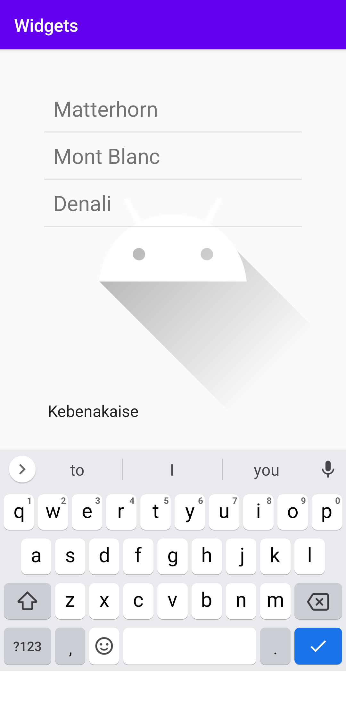
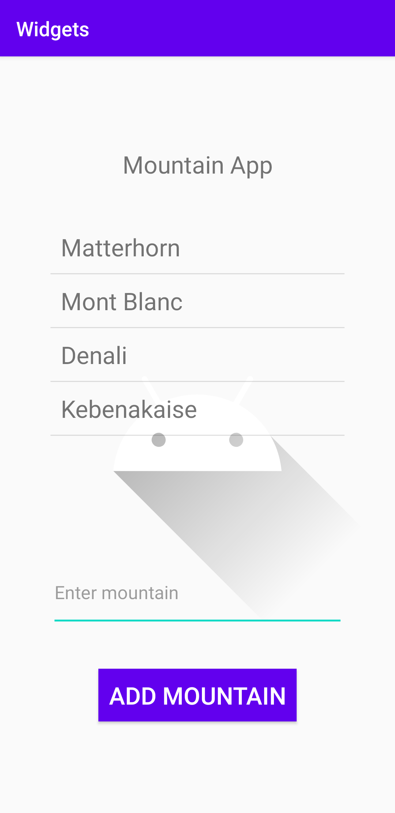
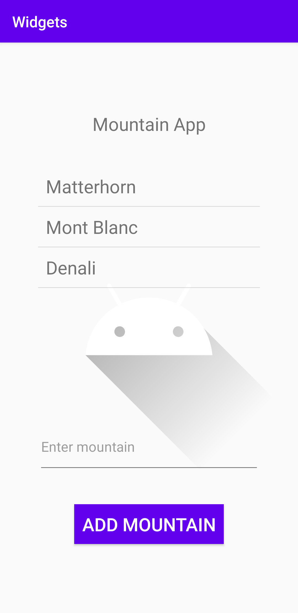

# Rapport

**Assignment 3**

Uppgiften gick ut på att göra en app med ett antal olika komponenter med olika layouter. Appen har två olika layouter, en constraint layout och en linear layout. Appen använder constraint layout för att organinsera en imageview och en linear layout. På så sätt hamnar alla komponenter inuti linear layout under varandra på ett snyggt och smidigt sätt. Här används centrering och marginaler på underliggande komponenter inuti den linjära layouten.

Det finns en lista med olika berg som är en listview som lagrar flera textview inuti. Därför skapas en arrayadapter som lagrar alla textview element.

```
        mountains.add(new Mountain("Matterhorn"));
        mountains.add(new Mountain("Mont Blanc"));
        mountains.add(new Mountain("Denali"));
        final ArrayAdapter<Mountain> adapter = new ArrayAdapter<Mountain>(this, R.layout.list_item_textview,
                R.id.list_item_textView,mountains);
        final ListView my_listView = (ListView) findViewById(R.id.my_listView);
        my_listView.setAdapter(adapter);
        my_listView.setOnItemClickListener(new AdapterView.OnItemClickListener() {
            @Override
            public void onItemClick(AdapterView<?> parent, View view, int position, long id) {
                Toast.makeText(getApplicationContext(), "Bla bla", Toast.LENGTH_SHORT).show();
            }
        });
```
Här skapas en arraylist som lagrar berg som sedan läggs i en ArrayAdapter med en layout från xml som heter list_item_textview. Sedan sätts adaptern till listvyn(my_listView).
Istället för att ha en array med alla berg så skapdes istället en klass så det blir lättare att lägga till berg. Vilket görs när man trycker på knappen till listan.
I appen används tre olika vyer. En knapp, en edittext och en imagelayout. 

```
public class Mountain {
    private String name;
    private String location;
    private int height;

    Mountain(String name){
        this.name = name;
    }

    Mountain(String name, String location, int height){
        this.name = name;
        this.location = location;
        this.height = height;
    }

    @Override
    public String toString(){
        return name;
    }
}
```

Varje berg skrivs ut i en lista där varje rad representeras av en textview. 

```
<TextView xmlns:android="http://schemas.android.com/apk/res/android"
    android:id="@+id/list_item_textView"
    android:layout_width="wrap_content"
    android:layout_height="wrap_content"
    android:padding="10dp"
    android:textSize="24sp"></TextView>
```



För att lägga till ett berg så kan man fylla i editText och trycka på knappen.

```
        Button button = (Button) findViewById(R.id.button);
        button.setOnClickListener(new View.OnClickListener() {
            @Override
            public void onClick(View v) {
                Log.d("Hej","Du har tryck på knappen!");
                if(editText.getText().length() != 0){
                    mountains.add(new Mountain(editText.getText().toString()));
                    adapter.notifyDataSetChanged();
                    editText.getText().clear();
                    Toast.makeText(getApplicationContext(), "Added new Mountain", Toast.LENGTH_SHORT).show();
                }else{
                    Toast.makeText(getApplicationContext(), "Field can not be empty", Toast.LENGTH_SHORT).show();
                }
            }
        });

```


Alla widgets läggs till en linearLayout som i sin tur är nästlad i en constraintLayout. Sedan positioneras de i mitten och har ett mellanrum mellan varandra.

Tex:
```
<LinearLayout
        android:id="@+id/linearLayout"
        android:layout_width="match_parent"
        android:layout_height="match_parent"
        android:layout_margin="20dp"
        android:gravity="center"
        android:orientation="vertical"
        android:padding="10dp"
        app:layout_constraintBottom_toBottomOf="parent"
        app:layout_constraintEnd_toEndOf="parent"
        app:layout_constraintStart_toStartOf="parent"
        app:layout_constraintTop_toTopOf="parent">

        <TextView
        ...
```
Även en bild som finns när appen byggs sätts till bakgrund på appen via imageView.

``` <ImageView
        android:id="@+id/mountain"
        android:layout_width="match_parent"
        android:layout_height="match_parent"
        android:contentDescription="@string/image"
        app:layout_constraintBottom_toBottomOf="parent"
        app:layout_constraintEnd_toEndOf="parent"
        app:layout_constraintStart_toStartOf="parent"
        app:layout_constraintTop_toTopOf="parent"
        app:srcCompat="@drawable/ic_launcher_foreground"
        tools:ignore="VectorDrawableCompat" />
```


